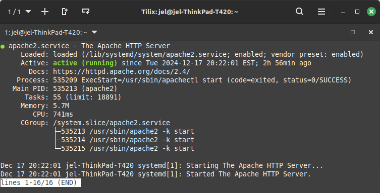

| Name | course | Semester | Instructor |
| --- | --- | --- |--- |
| Amiri Smith | CIS-106 | Fall '24 | R. Alberto |

# Deliverable 2

## Device Specifications

*status of running Apache service*

**What is the IP address of your Ubuntu Server Virtual Machine?**
192.168.1.179

**How do you enable the Ubuntu Firewall?**
sudo ufw enable

**How do you check if the Ubuntu Firewall is running?**
sudo ufw status

**How do you disable the Ubuntu Firewall?**
sudo ufw status

**How do you add Apache to the Firewall?**
sudo ufw allow 'Apache'

**What is the command you used to install Apache?**
sudo apt install apache2

**What is the command you use to check if Apache is running?**
sudo systemctl status apache2

**What is the command you use to stop Apache?**
sudo systemctl stop apache2

**What is the command you use to restart Apache?**
sudo systemctl restart apache2

**What is the command used to test Apache configuration?**
sudo apache2ctl configtest

**What is the command used to check the installed version of Apache?**
sudo apache2 -v

**What are the most common commands to troubleshoot Apache errors? Provide a brief description of each command.**
- **sudo apache2ctl configtest**
  - output alerts the user if any of the Apache configuration files have syntax errors
- **systemctl status apache2**
  - provides a general status of the Apache service on the device, including information like current running status, name of the Apache process, and the directory where the service is running from

**Which are Apache Log Files, and what are they used for? Provide examples and screenshots.**
Apache log files provide static logs of the use and running status of the Apache service. 

Apache access logs show information about web server requests made to the Apache web server, like the IP address a request was sent from, the relevant HTTP information like the request method and status code, and the browser and operating system the request was sent from (if applicable).

Apache error logs hold information about critical errors the Apache server may face, like a timestamp of when the error occurred, and the process ID of the service when the error occurred.

Apache error logs can be viewed with command-line tools for viewing text files, like grep or less, or with a text editor.

*Apache access log in xed text editor*

*Apache error log viewed using less command*