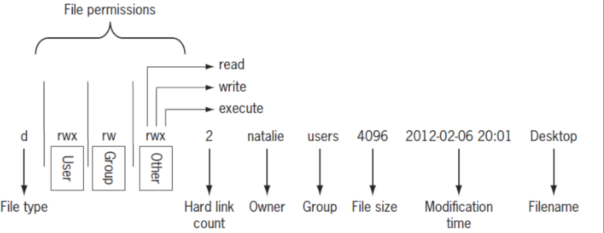

awk

### cat
- displays the contents of a file. cat = short for concatenate
> cat [option] [filepath]
#### Examples
- cat -E reciept.txt
  - prints reciept.txt with $ signs to denote end of a line
- cat -n reciept.txt
  - prints reciept.txt with numbered lines

### cp
copies specified files to a file/directory
- **usage**: cp [option] [file]
- **example**: cp -r myClasses ~/schoolwork
  - copies the myClasses folder and all of its contents to the schoolwork folder
- **example**: cp -u -r myClasses/history ~/schoolwork/

### cut
- separates and displays a certain part of a line in a file
> cut [option] [filepath]
#### Examples
- -d delimiter to specify sections
- -c certain characters
- -f specific fields

grep

### head
- displays the first of a specified number of lines in a file. displays 10 lines by default.
> head [option] [filepath]
#### Examples
- -v prints header
- -c prints by bytes

ls

man

### mkdir
creates a new directory in the pwd, with the specified name 
- **usage**: mkdir [option] [directory]
- **example**: mkdir -p myClasses/math
  - creates a directory myClasses, and the subdirectory math
- **example**: mkdir ~/Documents/{Legal, Personal, Work}
  - creates three directories named Legal, Personal, and Work, in the Documents folder.
- **example**: mkdir wip finalRender
  - creates two directories, wip and finalRender, in the current working directory

### mv
moves or renames the specified files
- mv [option] [file/directory]
- **example**: mv newImages/file.png home/user/Pictures
  - moves the specified file.png from the newImages folder to home/user/Pictures

## tac
- like cat, but displays file contents in reverse order
> tac [option] [filepath]
#### Examples
  - tac -E reciept.txt
  - prints reciept.txt in reverse order, and  $ signs to denote end of a line
- cat -n reciept.txt
  - prints reciept.txt in reverse order with numbered lines
- absolute path

### tail
- displays the last of a specified number of lines in a file. displays 10 lines by default
> tail [option] [filepath] 
#### Examples
- -v prints header
- -c prints by bytes

## touch
updates the timestamp of the specified file
- **usage**: touch [option] [file]
- **example**: touch newfile.png
  - creates a new empty file named newfile.png
- **example**: touch -c myEssay.odt
  - updates the timestamps on myEssay.odt if it exists. if it doesnt, the -c option prevents it from creating the file
- **example**: touch resume.pdf --date="Sun Nov 3"
  - updates the date of resume.pdf to Sunday, November 3rd of the current year, at 12:00 am

### tr
- changes (or removes) the specified character in the output of a file to another
> output to pipe | tr [option] [character being changed] [character to change to]
#### Examples
- -d to delete specified chars

tree

---

Working with Git, GitHub, and Markdown

    How to create a github repository
    How to clone a github repository
    How to use the git commands
    How to write a markdown file that contains images and proper headings
        - images: 
    How to convert a markdown file to pdf

How to Practice?

    Create a repository in github. Give it any name you want.
    Clone the repository in your virtual machine
    Open the repository/folder/directory in vs code
    Create a markdown file inside containing random text. Make sure you have headings, images, pagrapaths, bullet points etc…
    Convert the file to html and pdf
    Push everything to github
    Do you see the files there?
    Add a couple more html files by repeating the process.
    Did you get lost? if so, you know what you need to study!

Linux Specific Concents

    How to compress (zip) a directory/folder
    - zip command
    The linux filesystem
    Absolute path and relative path
        absolute: from root
        relative: from current folder

    When should you use absolute vs relative
    Moving around the filesystem with absolute and relative (pwd,cd, ls, and tree)
    How to work with multiple terminals open?
        use tilix.. 
    How to work with manual pages?
    man [command name]
    How to parse (search) for specific words in the manual page
        - /[pattern] when in man. h also is help page
    How to redirect output (>, >>, and |)
    How to append the output of a command to a file
    How and when to redirect the output of a command to another (pipes)
    How to use echo and output redirection to create a new file that contains some text
    How to use wildcards
        For copying and moving multiple files at the same time
    How to use brace expansion
        For creating entire directory structures in a single command

